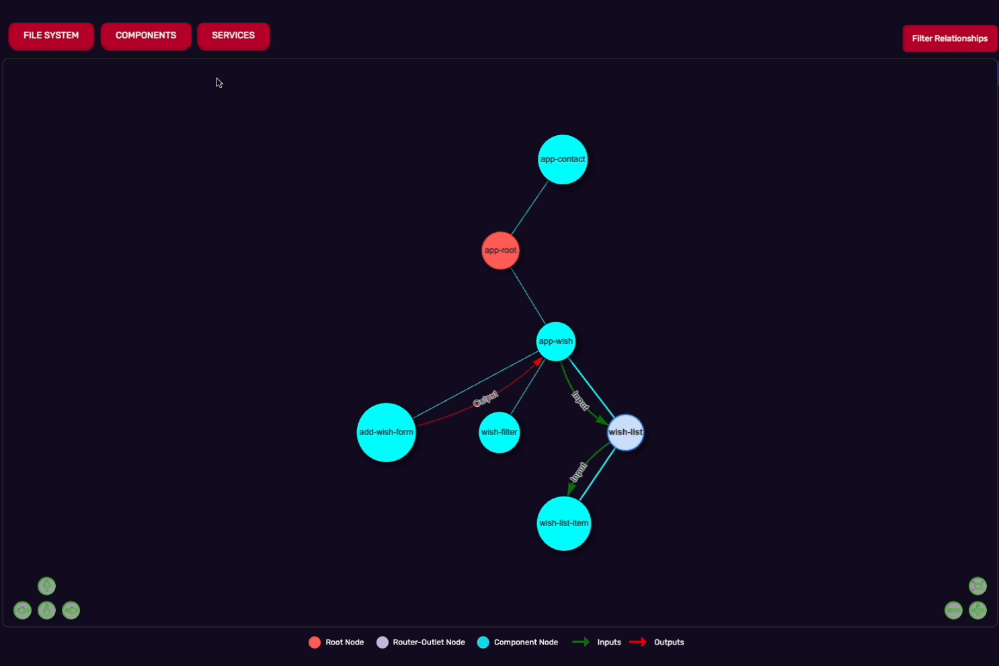

  

 
  
  

 
  
  

#

## AnguLens

Welcome to AnguLens, a VSCode extension build to aid understanding of Angular based projects through visualization.
Visit our landing page [here.](https://www.example.com){:target="_blank"}

## Features 

Using AnguLens you can: 
  - Choose a project directory
  - View folder-file hierarchy 
  - Navigate to selected files in views via double click 
  - View inputs / outputs of all components
  - View routers 
  - View component hierarchy between parent and child components
  - View additional information of files on click via modal 

## Getting started

### Starting source directory

1. Install AnguLens from extension marketplace 
2. Open commands (cmd/ctrl + shift + p) and run "Start AnguLens" 
3. Right click on "src" folder in Angular project 
4. Click "Copy Path"
5. Paste path into text input and click generate

# Folder-File view
Displays file structure of selected directory 
- Click on folders to open or close them for a cleaner view 

- Double click files to navigate current VSCode window to clicked file 

# Component view
Displays component hierarchy, including routers, with overlayed connections representing different connections
- Filter component connections using dropdown menu
  - Inputs/Outputs
  - Component Hierarchy
- Click on components to get additional information in modal
  -Inputs
  -Outputs
  -Services

# Services view
-Displays every service as a new network, with any components that utilize that service

[contributors-url]: https://github.com/oslabs-beta/AnguLens/graphs/contributors
[contributors-shield]: https://img.shields.io/badge/Contributors-4-darkred?logoColor=white
[version-shield]: https://img.shields.io/badge/version-1.0.0-darkred?logoColor=white
[angular-shield]: https://img.shields.io/badge/Angular-darkred?style=flat-square&logo=angular
[angular-url]: https://angular.io/
[typescript-shield]: https://img.shields.io/badge/TypeScript-blue?style=flat-square&logo=typescript&logoColor=white
[typescript-url]: https://www.typescriptlang.org/

# Contributing
AnguLens is an open source project and we encourage iteration and or contribution. To coontribute fork the repo, make feature branches, and PR from your feature branch into AnguLen's dev. 

## Current Roadmap
  - Removing use of retain context when hidden from VSCode API and use state instead
  - Support for Workspaces/monorepos
  - Mapping Signals
  - Expanding module support 
  - Mapping Observabels 
